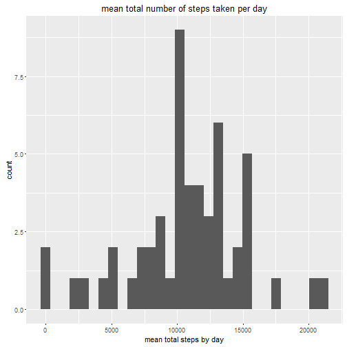
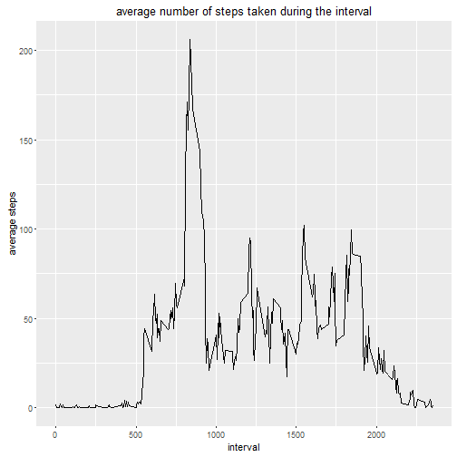
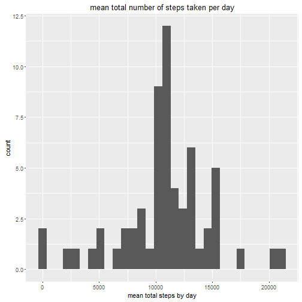
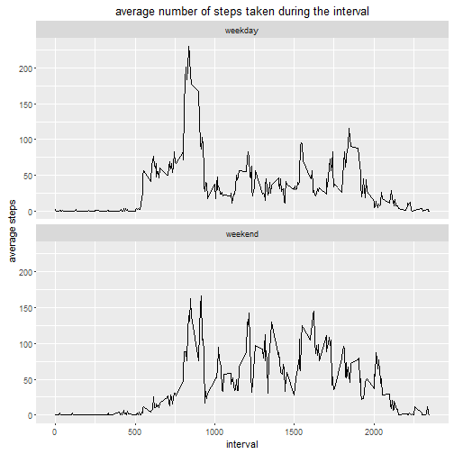

## Loading and preprocessing the data

```r
activity <- read.csv("activity.csv")
```


## What is mean total number of steps taken per day?
- Make a histogram of the total number of steps taken each day

```r
activity_total_by_day <- aggregate(steps ~ date, data=activity, FUN=sum, na.rm=TRUE)
library(ggplot2)
ggplot(activity_total_by_day, aes(steps)) + geom_histogram(bins=30) + xlab("mean total steps by day") + ggtitle("mean total number of steps taken per day")
```



- Calculate and report the mean and median total number of steps taken per day

mean

```r
mean(activity_total_by_day$steps)
```

```
## [1] 10766.19
```

median

```r
median(activity_total_by_day$steps)
```

```
## [1] 10765
```


## What is the average daily activity pattern?
- Make a time series plot (i.e. type = "l") of the 5-minute interval (x-axis) and the average number of steps taken, averaged across all days (y-axis)


```r
activity_avg_by_interval <- aggregate(steps ~ interval, data=activity, FUN=mean, na.rm=TRUE)
library(ggplot2)
ggplot(activity_avg_by_interval, aes(x=interval, y=steps)) + geom_line() + xlab("interval") + ylab("average steps") + ggtitle("average number of steps taken during the interval")
```



- Which 5-minute interval, on average across all the days in the dataset, contains the maximum number of steps?


```r
max_row_index <- which.max(activity_avg_by_interval$steps)
activity_avg_by_interval[max_row_index,]$interval
```

```
## [1] 835
```


## Imputing missing values

- Calculate and report the total number of missing values in the dataset (i.e. the total number of rows with NAs)


```r
sum(is.na(activity$steps))
```

```
## [1] 2304
```

- Devise a strategy for filling in all of the missing values in the dataset. The strategy does not need to be sophisticated. For example, you could use the mean/median for that day, or the mean for that 5-minute interval, etc.
- Create a new dataset that is equal to the original dataset but with the missing data filled in.

```r
# replace NA values with the mean value for that 5-minute interval
activity_imputed <- activity
for(i in 1:nrow(activity_imputed)) {
    if(is.na(activity_imputed[i,]$steps)) {
        interval <- activity_imputed[i,]$interval
        activity_imputed[i,]$steps <- activity_avg_by_interval[activity_avg_by_interval$interval == interval,]$steps
    }
}
```

- Make a histogram of the total number of steps taken each day and Calculate and report the mean and median total number of steps taken per day. Do these values differ from the estimates from the first part of the assignment? What is the impact of imputing missing data on the estimates of the total daily number of steps?


```r
activity_imputed_total_by_day <- aggregate(steps ~ date, data=activity_imputed, FUN=sum, na.rm=TRUE)
library(ggplot2)
ggplot(activity_imputed_total_by_day, aes(steps)) + geom_histogram(bins=30) + xlab("mean total steps by day") + ggtitle("mean total number of steps taken per day")
```



mean

```r
mean(activity_imputed_total_by_day$steps)
```

```
## [1] 10766.19
```

median

```r
median(activity_imputed_total_by_day$steps)
```

```
## [1] 10766.19
```


## Are there differences in activity patterns between weekdays and weekends?

- Create a new factor variable in the dataset with two levels -- "weekday" and "weekend" indicating whether a given date is a weekday or weekend day.


```r
activity_imputed$date <- as.Date(activity_imputed$date)
weekends <- c("“ú—j“ú", "“y—j“ú")
activity_imputed$weekday <- as.factor(ifelse(weekdays(activity_imputed$date) %in% weekends, "weekend", "weekday"))

median(activity_imputed_total_by_day$steps)
```

```
## [1] 10766.19
```

- Make a panel plot containing a time series plot (i.e. type = "l") of the 5-minute interval (x-axis) and the average number of steps taken, averaged across all weekday days or weekend days (y-axis). The plot should look something like the following, which was created using simulated data:


```r
activity_aggregated <- aggregate(steps ~ interval + weekday, data=activity_imputed, FUN=mean)

library(ggplot2)
ggplot(activity_aggregated, aes(x=interval, y=steps)) + geom_line() +
    facet_wrap(~ weekday, ncol = 1) + xlab("interval") + ylab("average steps") + ggtitle("average number of steps taken during the interval")
```


